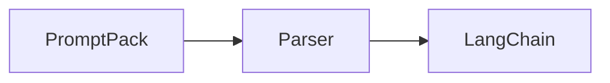

# PromptPack Python Documentation

This directory contains the documentation site for PromptPack Python, built with [Astro](https://astro.build) and [Starlight](https://starlight.astro.build).

## Getting Started

### Prerequisites

- Node.js 18 or higher
- npm

### Installation

```bash
npm install
```

### Development

Start the development server:

```bash
npm run dev
```

The site will be available at `http://localhost:4321`.

### Build

Build the production site:

```bash
npm run build
```

### Preview

Preview the production build:

```bash
npm run preview
```

## Project Structure

```
docs/
├── public/              # Static assets
│   ├── favicon.svg
│   ├── logo.svg
│   └── mermaid-init.js  # Mermaid diagram support
├── src/
│   ├── content/
│   │   ├── config.ts    # Content collection config
│   │   └── docs/        # Documentation pages
│   └── styles/
│       └── custom.css   # Theme customizations
├── astro.config.mjs     # Astro configuration
├── package.json
└── tsconfig.json
```

## Writing Documentation

Documentation pages are written in Markdown or MDX and placed in `src/content/docs/`.

### Frontmatter

Each page should have frontmatter:

```yaml
---
title: Page Title
description: Page description
sidebar:
  order: 1  # Controls ordering
---
```

### Diagrams

Mermaid diagrams are supported in code blocks:



## Scripts

| Command | Description |
|---------|-------------|
| `npm run dev` | Start dev server |
| `npm run build` | Build production site |
| `npm run preview` | Preview production build |
| `npm run check-links` | Check for broken links |
